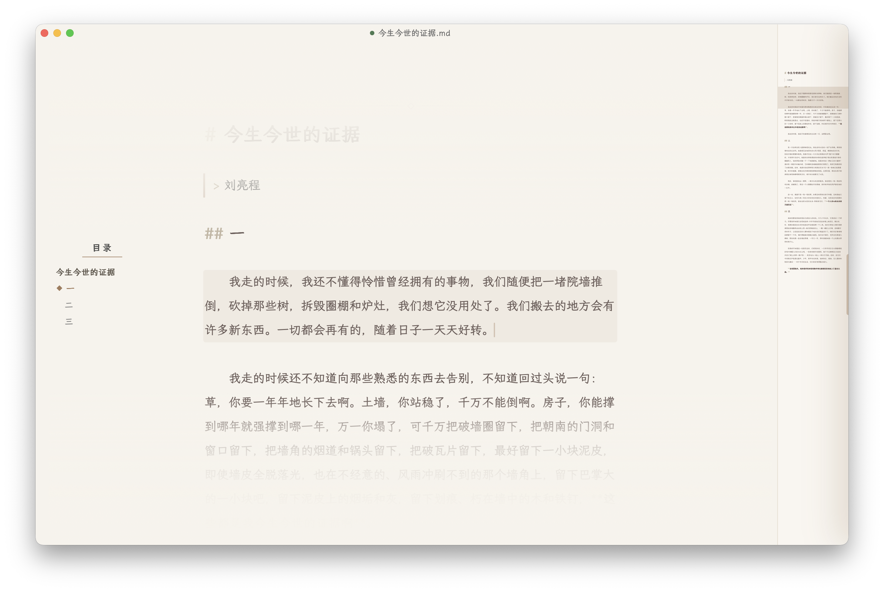

<h1 align="center">
   
  Irori
</h1>

轻量、独立的桌面 Markdown 编辑器

名称取自「围炉里」（Irori）。炉火居中，众人围坐，温暖而安宁 —— 那是宜于沉思与低语的所在，
也是 Irori 希望为书写留出的一方空间。

  

## 设计理念

Irori 致力于营造一个专注于书写的环境。它的初衷，是让创作回归人本身的思考与表达，因此目前并无引入 AI 的计划。
相较于科研、软件开发与日常工作，它更关注日记、博客、散文这类私人而饱含情绪的写作。

- **轻量**：不追求繁复的文件管理能力，现阶段亦不考虑多文件支持。
- **语法树式渲染**：依据 Markdown 的语法结构呈现样式，而非 Typora 式的所见即所得 —— 这是出于作者个人的审美取向。
- **VS Code 风格的页面预览**：侧边缩略图完整映射全文，篇幅与书写进度一目了然。

## 快捷键

| 键 | 作用 |
| --- | --- |
| `⌘S` / `⌘⇧S` | 保存 / 另存为 |
| `⌘N` / `⌘O` / `⌘W` | 新窗口 / 打开 / 关闭窗口 |
| `⌘P` | 导出为 PDF |
| `⌘\` | 开关抽屉 |
| `⌘F` | 查找 |
| `⌘B` / `⌘I` | 粗体 / 斜体 |
| `⌘Z` / `⌘⇧Z` | 撤销 / 重做 |
| `Esc` | 关闭抽屉或查找面板 |

在 Windows 与 Linux 上，以 `Ctrl` 代替 `⌘`。

## 开发状态

项目目前仍处于快速迭代阶段，部分交互逻辑可能发生较大调整。
